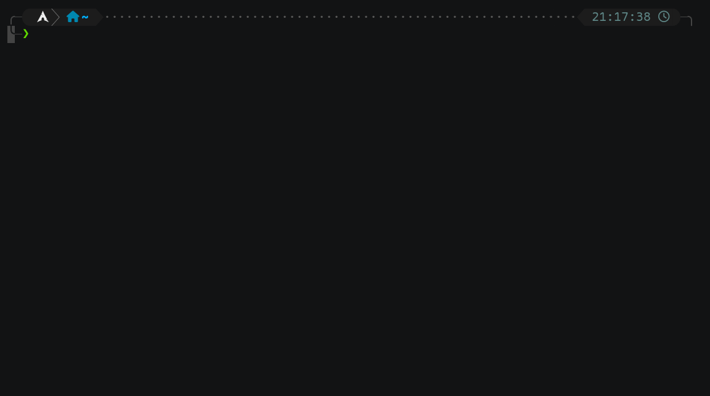
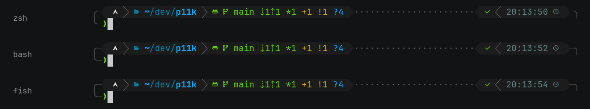
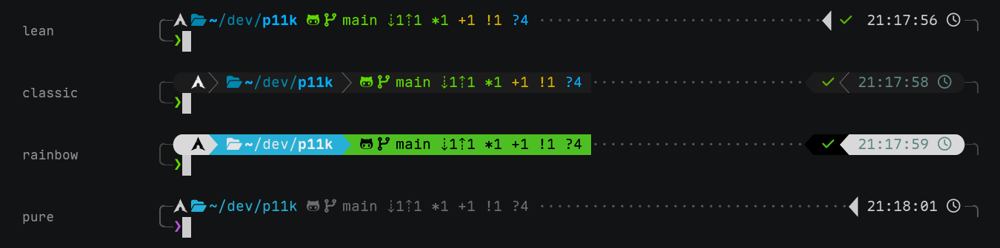

# powerlevel11k (p11k)

[中文](README.zh.md) · [](https://github.com/Qaaxaap/powerlevel11k/actions/workflows/ci.yml) · [](COPYING.LESSER)

A prompt engine that continues powerlevel10k, written in Rust.



p11k is a work in progress (1.0.0-alpha.1): feature-complete and used daily, but
not settled yet — the config language can still change.

powerlevel10k entered pure maintenance mode in 2024: no new features, most bugs
left unfixed, issues unanswered, and the repository will not be handed over. It
still works well today, but there is nowhere to go for anything past v1.20.0.
p11k takes over from there: the look and the speed of p10k, with the whole chain
rewritten in Rust.

It is no longer a traditional shell theme. The engine owns the terminal
directly — a pty host plus a transparent proxy — runs a theme-less shell inside
that pty, passes bytes through untouched, and only takes over at the moment a
prompt appears. The same theme therefore runs on zsh, bash, fish and pwsh,
which is something p10k cannot do.

## Try it

```bash
nix run github:Qaaxaap/powerlevel11k -- --shell zsh   # no install, no config
```

Anything else is under [Installing](#installing).

## One theme, every shell

The header is drawn by the engine, not by the shell, so one theme file gives the
same prompt under zsh, bash and fish (pwsh uses the same layer).



## Presets

`--preset lean|classic|rainbow|pure` picks a starting point without writing a
config, and `p11k configure` walks through the same choices as p10k's wizard and
writes out the KDL. All four are ordinary themes — anything in them can be
edited.

The four palettes are shown in one layout so that they can be compared. A preset
also carries a layout of its own: lean and pure are single-line and unframed.
Colours come from the preset, and a segment a preset does not define keeps the
terminal's default.



## Features

- **Multi-line header**: p10k style, generated from a KDL v2 config.
- **Instant header**: the prompt is on screen as soon as the terminal opens,
  without waiting for the shell to finish loading its config.
- **Transient prompt** (zsh only): the header folds into a single `❯` line once
  a command is submitted, matching p10k's `TRANSIENT_PROMPT`. Other shells are
  not supported.
- **vi_mode / history / loose layout**: vi mode indicator, history command
  number, `prompt-add-newline` blank lines and the like, enabled per config.
- **80+ built-in segments**: dir, vcs, status, time, command_execution_time,
  background jobs; language versions (go/rust/node/php/java/dotnet/swift/…);
  cloud (aws/azure/gcloud/kube/terraform); network (ip/vpn/wifi/public_ip);
  system (load/ram/swap/battery/disk); environment indicators
  (virtualenv/pyenv/rvm/nvm/…). They correspond one-to-one with p10k's
  segments.
- **git status**: computed on a background thread, so even a nixpkgs-scale
  repository does not block the prompt.
- **KDL v2 theme language**: `layout` / `segments` / `defaults` / `separators` /
  `frame` / `vcs-remote-icons` / `mode` / `icon`; see
  [docs/config-language.md](docs/config-language.md). Visuals are not hardcoded
  in the engine, so swapping the config swaps the theme.
- **Three icon sets**: `nerdfont` / `compatible` / `ascii`, picked to match the
  font in use; a non-UTF-8 locale falls back to `ascii` automatically. A
  top-level `icon{}` overrides individual characters per tier.

## How the engine works

The engine is a pty host and a transparent proxy: it starts a theme-less shell
in a pty, forwards bytes untouched, and only takes over drawing at the moment a
prompt appears.

Once a shell hook announces that the prompt is ready, the engine draws the
theme header and hands control back when it is done. The input line is still
drawn by the shell's own line editor, so completion, history and vi mode stay
geometrically consistent.

The geometry is guaranteed by the placeholder protocol: the shell renders a
theme skeleton made of placeholders, and the engine fills in the real header
once that skeleton is on screen. The engine does not parse ANSI sequences out
of the pty stream, and does not touch user input.

## Installing

With Nix, from the flake:

```bash
nix run github:Qaaxaap/powerlevel11k -- --shell zsh   # try it without installing
nix profile install github:Qaaxaap/powerlevel11k
```

As a home-manager input:

```nix
inputs.p11k.url = "github:Qaaxaap/powerlevel11k";
home.packages = [ inputs.p11k.packages.${pkgs.system}.default ];
```

On Debian and Ubuntu, from the `.deb` attached to a
[release](https://github.com/Qaaxaap/powerlevel11k/releases):

```bash
sudo apt install ./p11k_<version>_amd64.deb
```

Anywhere else, unpack the tarball. `bin/` and `share/` are relocatable: the
catalogs are looked up in the system directory and next to the executables
alike.

```bash
tar xzf p11k-<version>-x86_64-linux.tar.gz -C ~/.local
~/.local/p11k-<version>-x86_64-linux/bin/p11k --shell zsh
```

The tarball needs the OpenSSL 3 runtime, which common distributions ship by
default.

To build and install from source:

```bash
cargo install --path crates/p11k-engine
```

This needs a Rust toolchain. `msgfmt` (gettext) generates the translations; a
missing `msgfmt` still builds, the interface simply has no translations.

All builds are x86_64 Linux.

## Wiring it into a shell

If another shell theme is in use, remove it first: p11k is not a traditional
shell theme, and the two would stack on screen.

Add one line to the shell's rc file:

```bash
# zsh
[[ -z "$P11K_ENGINE" ]] && exec /path/to/p11k --shell zsh
# bash
[[ -z "$P11K_ENGINE" ]] && exec /path/to/p11k --shell bash
# fish
if not set -q P11K_ENGINE; exec /path/to/p11k --shell fish; end
```

For PowerShell, put this in `$PROFILE`:

```powershell
if (-not $env:P11K_ENGINE) { & '/path/to/p11k' --shell pwsh; exit }
```

`--shell` may be left out: `shell "zsh"` in the theme config names the shell
instead. With neither, the engine falls back to `$SHELL` — but `$SHELL` does not
change when pwsh is started from zsh or bash, so naming it explicitly is more
reliable.

The engine execs over the shell that started it and inherits its environment;
the inner shell re-sources the user config, except for the theme. `P11K_ENGINE`
prevents recursive startup.

## Theme configuration

The theme is a KDL v2 file; the syntax is in
[docs/config-language.md](docs/config-language.md).

The engine reads `$XDG_CONFIG_HOME/p11k/p11k.kdl`, usually
`~/.config/p11k/p11k.kdl`, and falls back to the built-in lean theme when that
file does not exist; the `p11k configure` wizard writes its config there.
`--config <path>` names a different file, and `--preset <name>` selects a
built-in theme (lean / classic / rainbow / pure).

`p11k reload` makes a running session re-read the theme file, with no need to
restart the shell:

```bash
$EDITOR ~/.config/p11k/p11k.kdl
p11k reload
```

The engine repaints the header and restarts its git worker, so `vcs`
properties take effect as well. A file that fails to parse is reported by the
command and the theme in use is kept. The width of the input line is fixed when
the engine starts, so a `prompt_char` of a different width is ignored and
recorded in the engine log; colours, layout, segments, separators and the frame
apply immediately.

## Interface language

The interface is available in Chinese and English, and more translations are
welcome. The language is selected through the standard environment variables
(`LANG`, `LC_ALL`, `LANGUAGE`) and defaults to English:

```bash
LANG=zh_CN.UTF-8 p11k --shell zsh   # Chinese interface
p11k --shell zsh                    # English (default)
```

`P11K_LOCALEDIR` can point at a catalog directory; installations through a
package or the flake need no such setting.

## compat/p10k: replacing gitstatusd

The `compat/p10k` branch vendors the original p10k theme and replaces only its
core: `p11k-d` answers on the gitstatusd wire protocol, byte for byte, and
works as the backend of the original `gitstatus.plugin.zsh`.

```zsh
export GITSTATUS_DAEMON=/path/to/p11k-d
```

Configuration, appearance, status and vcs are identical to p10k.

That branch is not the main line of development; `main` carries the engine, but
it will still be maintained.

## Status & roadmap

Done:

- gitstatusd-compatible core (v1.5.5 protocol) and the performance core: index
  parsing, `fstatat` scanning, parallel shards, untracked cache
- placeholder protocol: self-consistent multi-line geometry across zsh / bash /
  fish / pwsh
- instant / transient prompt, vi_mode, history, loose layout
- 80+ segments, the KDL theme language, three icon tiers and `icon{}` overrides
- the `p11k configure` wizard, gettext catalogs (zh_CN), CI
- `p11k reload`; p10k feature parity up to the extended status states
  (`OK_PIPE` / `ERROR_PIPE` / `ERROR_SIGNAL`) and
  `VCS_DISABLED_WORKDIR_PATTERN`
- release artifacts: a Nix flake, a `.deb` and a tarball

Roadmap:

- the p10k knobs that are still missing, all of them differing only at
  non-default settings: `ICON_PADDING=moderate`, explicit
  `ICON_BEFORE_CONTENT` overrides, `TRANSIENT_PROMPT=same-dir`
  (`transient-prompt #true` equals p10k's `always`) and `LEGACY_ICON_SPACING`.
  Rendering under p10k's defaults already matches. `DIR_MAX_LENGTH` and
  `DIR_MIN_COMMAND_COLUMNS(_PCT)` cannot be implemented: they need to read
  zle's buffer, which the engine never sees.
- macOS support
- long-term maintenance and hardening of the daemon and the engine

## Contributing

Build and test environment, commit conventions, the translation workflow and
the release process are in [CONTRIBUTING.md](CONTRIBUTING.md).

## License

LGPL-3.0-or-later: [COPYING.LESSER](COPYING.LESSER) is the license itself,
[COPYING](COPYING) is the GPL-3.0 it extends.

The powerlevel10k theme vendored on the `compat/p10k` branch is MIT (c) Roman
Perepelitsa and contributors; the original copyright notice is kept in
`compat/p10k/vendor/powerlevel10k/LICENSE`.
